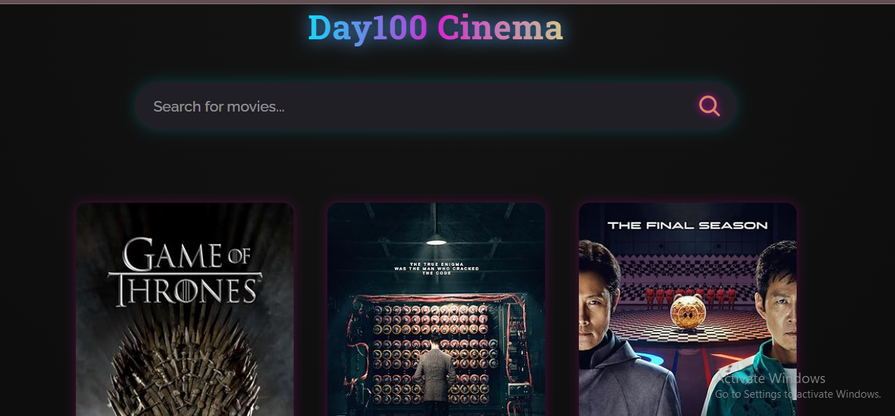

# 🎬 Day100 Cinema App

Welcome to **Day100 Cinema App**, a modern and responsive web app that allows users to search for and explore movies in real-time. This project marks one of the final milestones of my **100 Days of Code** journey — where I learned and applied the core principles of **React.js**.

---

## 🚀 Live Demo

💻 [GitHub Repository](https://github.com/kal1kidan/Day100-Cinema)

---

## 🧠 Key Features

* 🎥 **Movie Search** — Find movies instantly using the OMDb API.
* ⚡ **Dynamic Rendering** — Fetch and display results seamlessly with React’s state management.
* 🧩 **Reusable Components** — Built with modular, functional React components.
* 💅 **Stylish UI** — Beautiful gradient design with smooth hover effects.
* 📱 **Responsive Layout** — Fully optimized for all screen sizes.

---

## 🧰 Technologies Used

* **React.js**
* **JavaScript (ES6+)**
* **CSS3**
* **OMDb API**

---

## 📸 Preview

 

---

## 💡 What I Learned

This project helped me strengthen my understanding of:

* React components and props
* The `useState` hook and dynamic rendering
* API fetching using `fetch()`
* Managing component updates and re-renders
* Building an end-to-end front-end app

---

## 🏁 100 Days of Code — Day 99

Today marks **Day 99** of my 100 Days of Code journey!
Building this project has been a fulfilling experience that ties together everything I’ve learned about **JavaScript** and **React**. I’m excited to share it as one of my final projects before completing this amazing challenge. 💪

---

Would you like me to **insert your real GitHub link, Netlify link, and screenshot** placeholders for you next? I can make it ready to copy-paste directly into your repo.
